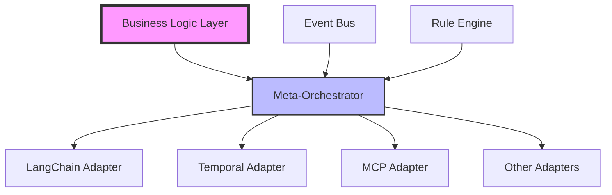

# Introduction

Welcome to **Bizy** - an enterprise-grade solution for orchestrating AI frameworks with business logic.

## What is Bizy?

Bizy provides a unified abstraction layer that enables you to:

- 🔗 **Integrate Multiple AI Frameworks** - Work seamlessly with LangChain, Temporal, MCP, Semantic Kernel, FastMCP, and Zep AI
- 📋 **Define Business Rules Once** - Use YAML-based rules that work across all frameworks
- 🚀 **Build Complex Workflows** - Coordinate multi-step processes with error handling and monitoring
- 📊 **Enterprise-Grade Features** - Production-ready with security, scalability, and observability

## Why Bizy?

Modern AI applications often require multiple frameworks working together:

- **LangChain** for LLM interactions
- **Temporal** for workflow orchestration  
- **MCP** for tool integration
- **Semantic Kernel** for AI agent coordination
- **FastMCP** for high-performance tools
- **Zep** for memory management

Without proper orchestration, integrating these frameworks leads to:
- Complex, tightly-coupled code
- Duplicated business logic
- Difficult maintenance and testing
- Limited reusability

Bizy solves these challenges by providing a framework-agnostic layer for business logic orchestration.

## Quick Example

```yaml
# Define a business rule
rule: customer_escalation
conditions:
  - customer.tier == "premium"
  - sentiment.score < 0.5
actions:
  - framework: langchain
    action: analyze_detailed
  - framework: temporal
    action: create_priority_ticket
  - framework: mcp
    action: notify_manager
```

```python
# Execute across frameworks
result = await orchestrator.evaluate_and_execute(
    rule_set="customer_service",
    context={
        "customer": customer_data,
        "sentiment": sentiment_result
    }
)
```

## Getting Started

Ready to orchestrate your AI frameworks?

import Link from '@docusaurus/Link';

<Link
  className="button button--primary button--lg"
  to="/docs/getting-started/installation">
  Get Started →
</Link>

## Key Features

### 🎯 Business Rule Engine
- YAML-based rule definitions
- Complex condition evaluation
- Priority-based execution
- Conflict resolution

### 🔄 Framework Adapters
- Consistent interface across frameworks
- Connection pooling and health checks
- Automatic retry and failover
- Framework-specific optimizations

### 📡 Event-Driven Architecture
- Real-time cross-framework communication
- Event persistence and replay
- Distributed event processing
- Audit trail generation

### 🛡️ Enterprise Security
- Role-based access control
- API key management
- Audit logging
- Data encryption

### 📈 Monitoring & Observability
- Prometheus metrics
- Distributed tracing
- Health dashboards
- Performance analytics

## Architecture Overview



## Community & Support

Join our growing community:

- 💬 [Discord](https://discord.gg/orchestrator) - Get help and share experiences
- 🐛 [GitHub Issues](https://github.com/getfounded/bizy/issues) - Report bugs and request features
- 📖 [Blog](/blog) - Latest updates and tutorials
- 🤝 [Contributing](/docs/community/contributing) - Help improve the project

## Next Steps

- [Installation Guide](/docs/getting-started/installation) - Set up your environment
- [Quick Start Tutorial](/docs/getting-started/quick-start) - Build your first workflow
- [Architecture Deep Dive](/docs/architecture/overview) - Understand the internals
- [API Reference](/docs/api/reference) - Detailed API documentation